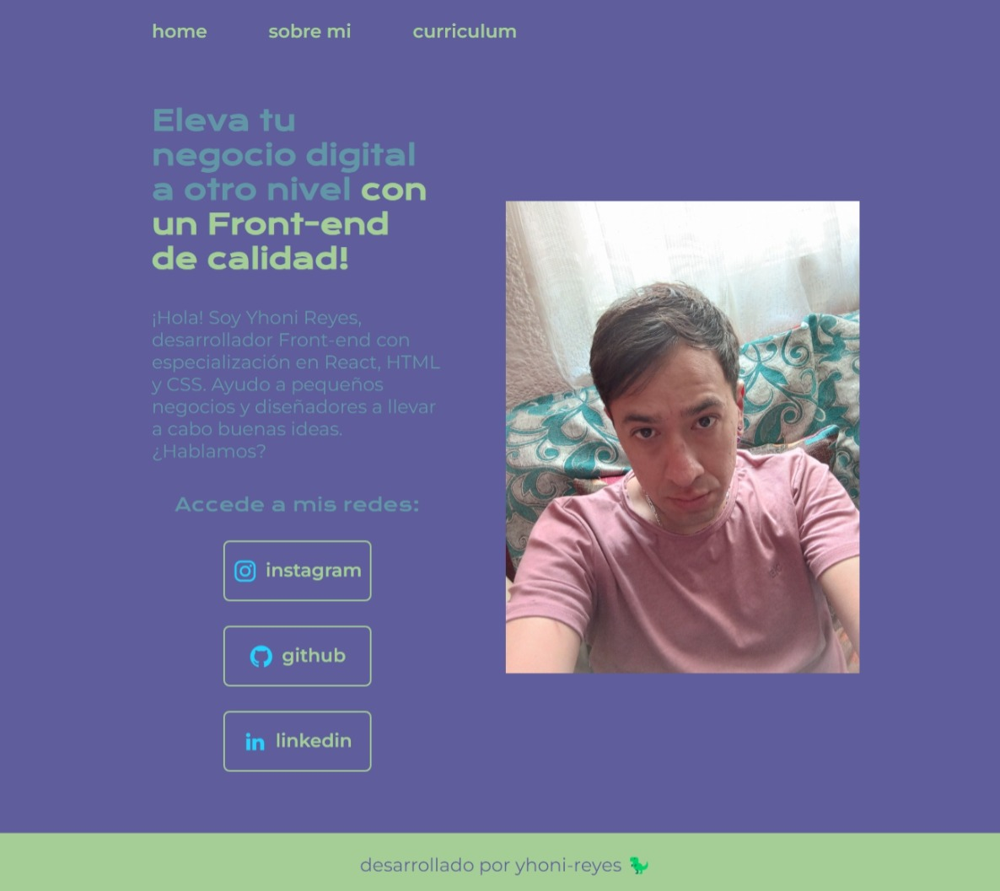

# Portafolio 
¡Hola, bienvenido a mi proyecto de portafolio!

## 🖼️ Vista Previa

 
## 🚀 Herramientas utilizadas:

* HTML

* CSS

* Flex-box

## 📌 Funcionalidades
✅ Ver la presentacion de mi portafolio
✅ Poder acceder a mis redes sociales 
✅ Ver la seccion sobre mi
✅ Ademas de conocer mi curriculum

## 🎲 Cómo usarlo
1. Ingresa en este enlace:
https://yonireyesm85.github.io/mi-portafolio/
2. Ve mi informacion 
3. Desplazate entre secciones con la navbar
4. Listo! ahora Ya! me conoces

## Hecho por:

### yhoni-reyes

### Linkedin: https://www.linkedin.com/in/jonathan-israel-reyes-m%C3%A9ndez-257b58318/
